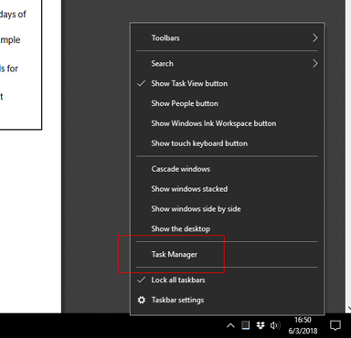
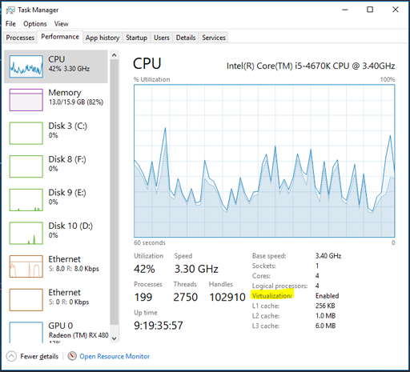

<table>
  <tr><td>Your Operating System name:</td><th id="os"></th></tr>
  <tr><td>Your Operating System version:</td><th id="version"></th></tr>
  <tr><td>Your Operating System bitness:</td><th id="bitness"></th></tr>
</table>

# System Requirements

To download and run the development software:

* Your operating system must be 64bit, **AND**
* It must support virtualization, **AND**
* Virtualization must be enabled.

If your computer does not meet the requirements, you can use [Amazon Cloud9](https://aws.amazon.com/cloud9/) instead.

# Checking Virtualization on Windows

This page can't automatically detect support for virtualization, so follow
these steps to perform the check yourself.

## Windows 8, Windows 8.1, and Windows 10
1. Right-click on an empty area of the taskbar, then click **Task Manager**.

2. Click on the **Performance** tab. If there are no tabs, click on
**More Details** to expand the Task Manager first.
3. On the lower right, look for the `Virtualization` value.

* **If Virtualization is Enabled**: You're all set to continue with Installfest.
* **If Virtualization is Disabled**: You must enable virtualization in your system
BIOS, or use Cloud9.
* **If the Virtualization label is missing**: You must use Cloud9.

## Windows 7
1. Download and run the Microsoft [Hardware-Assisted Virtualization Detection Tool](https://www.microsoft.com/en-us/download/confirmation.aspx?id=592). You
should see a window with your results.

* **If Virtualization is Enabled**: You're all set to continue with Installfest.
* **If Virtualization is Disabled**: You must enable virtualization in your system
BIOS, or use Cloud9.
* **If Virtualization is not supported**: You must use Cloud9.

## Other versions of Windows (Windows Vista, Windows XP, ...)
You must use Cloud9.

## Need help?

Ask a TA and they'll be happy to help you out! That's what they come to events
for, after all.
